# Práctica 1. Introducción y Preparación de Herramientas

## Objetivos
- Acceder por ssh de una máquina a otra.
- Acceder mediante la herramienta curl desde una máquina a la otra.
- Mostrar configuraciones de red y opciones de netplan.

## Instalación Ubuntu
Para la práctica he utilizado VirtualBox y Ubuntu Server 18.04.

Comienzo creando un adaptador red que utilizaré para la conexión "solo anfitrión".

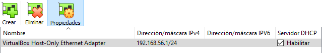

Después, creo las 2 máquinas virtuales que hay que utilizar y en la configuración de estas, en el apartado red, dejo el Adaptador 1 conectado a NAT y en el Adaptador 2 pongo el adaptador que he creado antes.

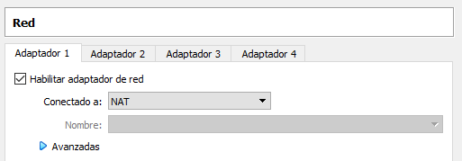

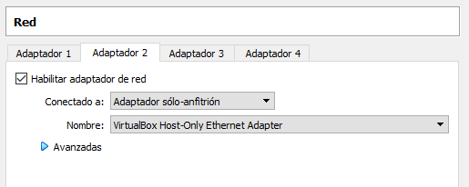

Una vez hecho esto, procedo a la instalación de Ubuntu Server. Simplemente hay que seguir los pasos del wizard, marcando la opción de instalar OpenSSH porque hará falta más tarde. Esta es la configuración que le he puesto a la 2ª máquina.

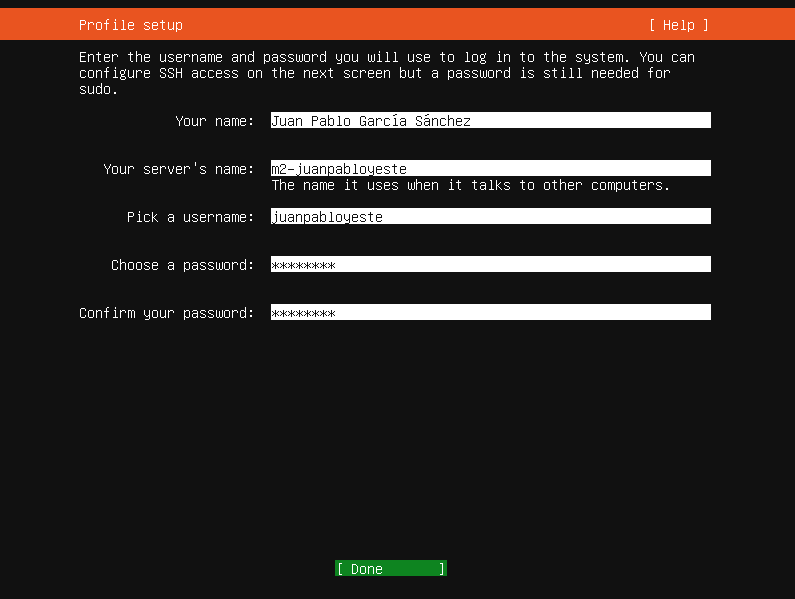

## Instalación LAMP

He decidido instalar LAMP a través de ```tasksel``` ya que instala todos los paquetes necesarios. Se hace a través de los comandos:

```sudo apt install tasksel```

```sudo tasksel install lamp-server```

Saldrá una pantalla como esta:

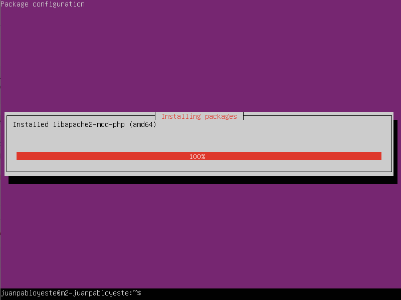

Compruebo que se hayan instalado correctamente Apache, MySQL y PHP.

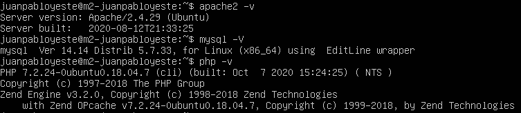

Y compruebo también que estén funcionando Apache y MySQL.

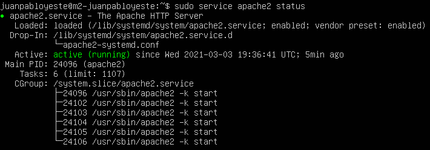

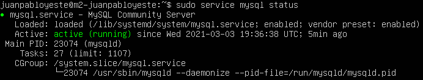

## Configuración del adaptador de red
Primero modifiqué los archivos ```/etc/netplan/00-installer-config.yaml``` (yo le dejé el nombre que traía por defecto, pero se puede poner cualquier nombre con tal de que acabe en .yaml). Así cambié la configuración de la interfaz ```enp0s8``` que es la conexión solo anfitrión para que tenga una IP estática en vez de utilizar DHCP. Como el adaptador tenía de IP ```192.168.56.1```, a la primera máquina le puse ```192.168.56.2``` y ```192.168.56.3``` a la segunda.

El archivo por defecto:

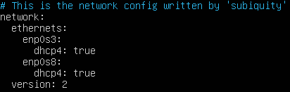

Una vez modificado:

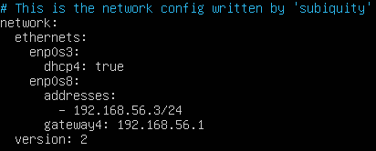

Ahora solo falta aplicar los cambios con ```sudo netplan apply``` y comprobar si se ha configurado la interfaz correctamente con ```ip a``` o ```ifconfig```.

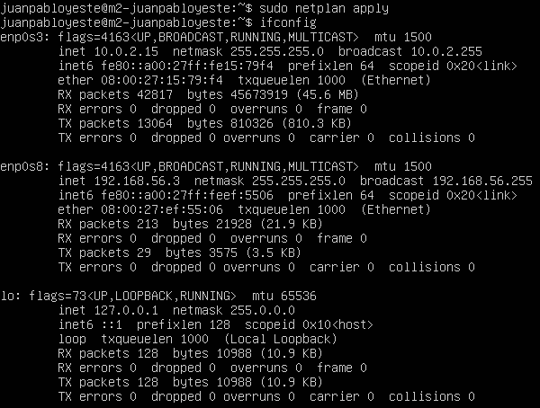

## Comprobación de la red

Ahora solo falta ver que ambas máquinas se pueden comunicar entre sí. Primero pruebo con un ping:

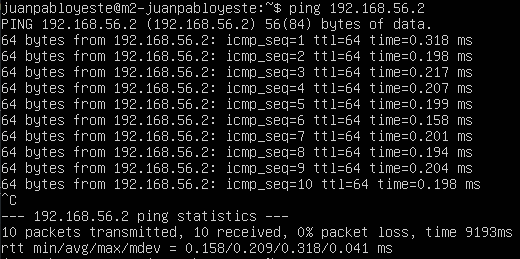

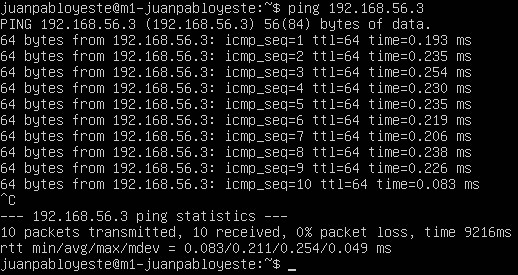

Después creo un archivo HTML en ```/var/www/html/ejemplo.html``` 

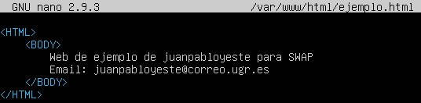

Y con ```curl http://ip/ejemplo.html``` compruebo si obtiene el .html de la otra máquina.

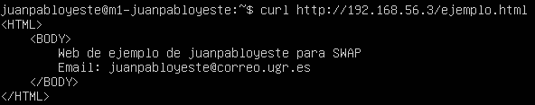

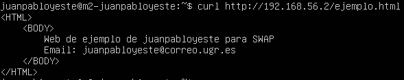

Este HTML se puede visionar en un navegador conectándose a la página ```http://ip/ejemplo.html```.


Por último, voy a comprobar también que puedo conectarme a través de ```ssh``` de una máquina a otra.

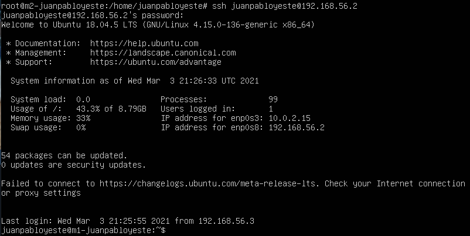

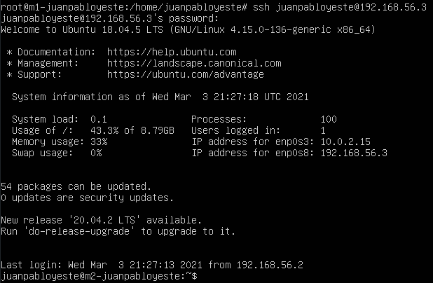