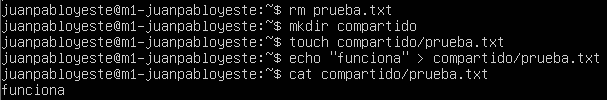

# Práctica 2. Clonar la información de un sitio web

## Objetivos
- Aprender a copiar archivos mediante ```ssh```.
- Clonar contenido entre máquinas.
- Configurar el servicio ```ssh``` para acceder a máquinas remotas sin contraseña.
- Establecer tareas en ```cron```.

## Crear un tar con ficheros locales o directorios en un equipo remoto
Tenemos 2 opciones para copiar ficheros ```tar``` en un directorio remoto.

### Redireccionar la salida de ```tar``` a ```ssh``` con un pipe

Primero creo la carpeta que vamos a compartir con ```mkdir``` y creo un archivo dentro con ```touch```. En este archivo escribo "funciona" simplemente para que a la hora de enviarlo le pueda hacer un ```cat``` y comprobar que se ha enviado correctamente.



Luego se crea el ```tar``` de la carpeta y redirecciona la salida al ```ssh``` para que cree el comprimido en la otra máquina.

```tar zcvf - compartido | ssh usuario@ipremoto 'cat > ~/archivo.tgz'```

El guión ```-``` necesita estar por separado, pues es una opción de ```tar``` para que escriba la salida en ```stdout``` en vez de en el sistema de archivos directamente. Si la salida no fuera a ```stdout```, el pipe no funcionaría ya que lee la información de ahí.


En la otra máquina compruebo que ha llegado el ```tar```, descomprimo y hago ```cat``` al archivo que había creado dentro.


La segunda forma de guardar los ```tar``` en un servidor remoto es con el comando ```scp``` que ya usa ssh internamente. Con ```scp``` la copia es segura y encriptada. Usaré el mismo directorio para este envío.

```scp -r compartido usuario@ipremoto:/directorio```


Y lo compruebo una vez más.


## Instalar la herramienta rsync

```rsync``` se puede instalar con ```sudo apt-get install rsync```. En mi caso ya venía instalado en las 2 máquinas.
Para empezar, haré que el usuario sea el dueño de los archivos del espacio web con ```sudo chown usuario:usuario -R /var/www```


Ahora, en la segunda máquina también voy a hacer que el usuario sea dueño de la misma carpeta y luego voy a clonar la carpeta de la primera máquina a la segunda con ```rsync -avz -e ssh ipmaquina1:/var/www/ /var/www/```.


Y por último compruebo que contengan lo mismo en las 2 máquinas.


## Acceso sin contraseña para ```ssh```

Para acceder por ```ssh``` a otra máquina directamente sin tener que utilizar contraseña, hace falta realizar un intercambio de claves públicas. Primero generamos en el cliente un par de claves RSA con ```ssh-keygen -b 4096 -t rsa```. Es importante dejar la "passphrase" en blanco, pues aunque sea más seguro ponerle una contraseña, si le ponemos passphrase nos la pedirá cada vez que nos conectemos con ```ssh``` y lo que buscamos es entrar automáticamente.


Ahora basta con copiar la clave pública a la máquina a la que nos queremos conectar con ```ssh-copy-id ipmaquina```


Ya solo queda intentar conectarse a la otra máquina y ver si no nos pide contraseña.


## Programar tareas con ```crontab```

Para programar tareas con ```crontab``` basta con editar el archivo ```/etc/crontab```. Por ejemplo, para que el servidor clone ```/var/www/``` cada hora hay que añadir la última línea que se ve en la foto:


Esto indica que al minuto 0 de cada hora de cada día de cada mes (es decir, cada hora cuando sean en punto), el usuario va a ejecutar ```rsync``` como hemos visto antes y clonará la carpeta de ```/var/www/```